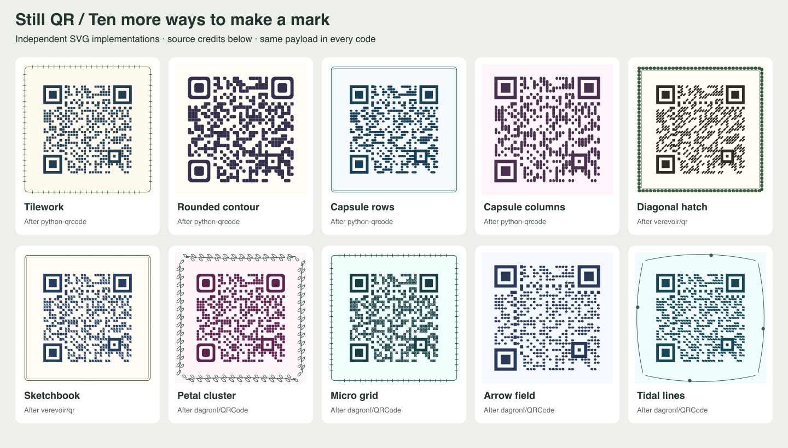

# Second style and tooling survey

Reviewed September 27, 2026. This extends [the original atlas](STYLE-ATLAS.md) with primary-source searches across vector drawing, image embedding, animation, fabrication, encoders, and independent decoders. The result is ten additional presets, ten reusable module shapes, and a working offline two-decoder assessment tool. The collection now has 45 presets and 31 shapes.



## Search scope and decisions

Searches covered neighbor-aware QR module drawers, diagonal/network/scribble SVG styles, pixel-shape libraries, halftone and QArt encoding, animated image backgrounds, stencil workflows, and JS/WASM decoders. Project documentation and author repositories below are the evidence; search snippets and third-party roundups were discovery aids. This is a broad practical survey, not an exhaustive inventory or comparative performance benchmark of upstream projects. Upstream demos were reviewed through their documentation; we did not install and run every project.

| Primary source | Result or tool investigated | Decision in this repo |
| --- | --- | --- |
| [python-qrcode](https://github.com/lincolnloop/python-qrcode), [module drawers](https://github.com/lincolnloop/python-qrcode/blob/main/qrcode/image/styles/moduledrawers/pil.py) | Gapped squares, neighbor-aware exposed-corner rounding, contiguous bars with rounded ends | Replicated those four visual mechanisms in SVG. No Python runtime or Pillow dependency. |
| [verevoir/qr](https://github.com/verevoir/qr) | Diagonal strokes, network/metro/circuit marks, Bezier scribbles, image-derived dots, traced outlines | Replicated diagonal and scribble families; keep the existing circuit mode. Full region tracing and image-density dot output remain candidates. |
| [dagronf/QRCode](https://github.com/dagronf/QRCode) | Broad pixel vocabulary including flower, grid2x2, arrow, wave, donut, vortex, and separate eye/pupil styling | Replicated flower, segmented grid, arrow, and wave families. Hollow centers need special care; they were not selected. No Swift dependency. |
| [qr-platform/qr-code.js](https://github.com/qr-platform/qr-code.js), [usage guide](https://github.com/qr-platform/qr-code.js/blob/main/docs/usage-guide.md) | Small squares, line styles, separate component fills and gradients | The new gapped and capsule tools cover more of this vocabulary. Separate pupil fills and gradient types remain possible extensions. |
| [tappleinc/qr-code-generator](https://github.com/tappleinc/qr-code-generator) | Dot scale, independent eye/pupil configuration, decorative borders, ASCII output | Gapped tiles demonstrate reduced module scale. No second encoder or logo overlay was needed. |
| [EFQRCode](https://github.com/EFPrefix/EFQRCode) | Native image/animation generation and styled QR workflows | Reference for future media exports; no native platform dependency added. |
| [Awesome-qr.js](https://github.com/SumiMakito/Awesome-qr.js) | Image backgrounds and animated GIF backgrounds | Existing local image mode covers still-image integration. GIF frame import/export is not implemented; SVG pulse is not equivalent to animated imagery. |
| [Russ Cox: QArt Codes](https://research.swtch.com/qart) | Fits pictures through freedom in the encoding itself | A different algorithmic tier from our tone projection. No claim of QArt encoding parity or arbitrary image reconstruction. |
| [kciter/qart.js](https://github.com/kciter/qart.js) | JavaScript QArt image generation and image fitting | Potential experimental encoder adapter, deferred until exact-payload behavior and output constraints can be tested independently. |
| [QR Stencil Creator](https://qrcreator.tedivm.com/) | SVG output with optional stencil cut lines | Fabrication requires connected islands and material-aware bridges. Our new grid style is visual artwork, not a ready-to-cut stencil. |
| [Segno](https://segno.readthedocs.io/en/stable/) | QR/Micro QR generation and multiple serializers | Useful external reference for format expansion and fixtures. No Python dependency or Micro QR support added. |
| [Nayuki QR Code generator](https://github.com/nayuki/QR-Code-generator) | Portable implementations and low-level encoding controls | Candidate for cross-encoder fixtures. Keep node-qrcode as the current production encoder. |
| [nuintun/qrcode](https://github.com/nuintun/qrcode) | JavaScript encoding and decoding in one project | Considered as another implementation for comparison; selected ZXing-C++ instead for a distinct decoder lineage. |
| [Sec-ant/zxing-wasm](https://github.com/Sec-ant/zxing-wasm) | ZXing-C++ exposed to JS through WebAssembly | **Installed and used** as a development dependency in `npm run assess` and regression tests. The WASM binary loads from the installed package, without CDN requests. |
| [OpenCV QRCodeDetector](https://docs.opencv.org/4.x/de/dc3/classcv_1_1QRCodeDetector.html) | Another detector/decoder for image validation | Future third opinion and camera corpus tool; not installed or claimed as tested. |

## Local replications and differences

These are original TypeScript/SVG implementations of credited visual mechanisms. They do not copy source code, logos, screenshots, or artwork from the projects. Matching the category of result does not imply pixel-identical reproduction. The names below belong to this repo; each preset's `credit` links to its upstream technique in the studio and library. The upstream projects are credited for their examples and tool design, not asserted to be the historical inventors of generic shapes.

| Preset / shape | Origin | Mechanism and adaptation |
| --- | --- | --- |
| Tilework / `gapped` | python-qrcode | An 80%-width square centered in each cell. The gaps are real geometry, not light-colored strokes. |
| Rounded contour / `contour` | python-qrcode | Round a corner only when both adjacent cells are light. Shared edges remain full width; unlike `classy`, this retains a full square inside dense regions. |
| Capsule rows / `horizontal-pill` | python-qrcode | Rounded horizontal cell with rectangular extensions toward dark neighbors. Runs have round caps and a uniform lane gap. |
| Capsule columns / `vertical-pill` | python-qrcode | Vertical version of the same connected-run construction. |
| Diagonal hatch / `diagonal` | verevoir/qr | Thick diagonal strokes with round ends. Strokes stay within their own data cells; no cross-cell diagonal routing. |
| Sketchbook / `scribble` | verevoir/qr | Two curved pen strokes per cell, with deterministic seeded variation. This is a cell-local interpretation, not their full routing algorithm. |
| Petal cluster / `flower` | dagronf/QRCode | Four overlapping circular lobes and a solid center. |
| Micro grid / `gridlet` | dagronf/QRCode | Four rounded subtiles. A small central disk bridges the cross-shaped gap to protect module-center sampling. The initial unbridged version failed both decoders. |
| Arrow field / `arrow` | dagronf/QRCode | Broad right-facing arrow with a filled center and a triangular point. |
| Tidal lines / `wave` | dagronf/QRCode | A filled cell bounded by two quadratic wave edges. This differs from the existing ripple material's continuous wave-front highlights. |

All ten work with existing borders, palettes, effects, recipe export, CLI generation, and PNG/SVG export. Structure and quiet-zone rules remain those of the shared renderer. The source presets use square or rounded finder eyes; reshaping finders is an independent control with its own risks. Material selection supersedes the selected module shape as before.

## Tools that now run here

```sh
npm run check          # all core tests, independent decoder regression, build
npm run test:browser   # every preset in the real browser raster path
npm run assess         # all 45 presets × 4 payloads × 4 conditions × 2 decoders
npm run style-sheet    # regenerate docs/style-expansion.png
npm run gallery        # SVG/PNG examples and the existing scan reports
```

`assess` writes `examples/generated/decoder-report.json` with individual results, actual payloads, image size, and ZXing WASM version. It returns status 2 if either decoder fails any case. Conditions are 768px export, 256px reduction, reduction with Gaussian blur σ 0.6, and reduction with contrast compressed to 55%. Both decoders receive identical RGBA pixels and must return the exact payload. Payloads cover a URL, a single character, Unicode/emoji, and Wi-Fi text. These are 720 rendered conditions, or 1,440 decoder decisions.

Measured on September 27, 2026 with zxing-wasm 3.1.4: **jsQR passed 720/720 conditions and ZXing passed 720/720 conditions** across all 45 presets. Animated presets are assessed at their resting frame. The full report is regenerated by the command above and uploaded with the gallery by CI.

ZXing is development-only; browser users and library consumers still use the existing jsQR checks and do not download a new runtime. The new regression test exercises all ten additions with URL and Unicode payloads and verifies that the assessment rejects an incorrect expected payload. The existing preset loop covers all four payloads with jsQR.

The WASM wrapper is MIT licensed; its reader includes ZXing-C++ under Apache-2.0 and other upstream notices distributed in the dependency. See [the upstream license inventory](https://github.com/Sec-ant/zxing-wasm#licenses). No third-party source was vendored into the shape renderer.

## Remaining experiments worth pursuing

1. Image-derived halftone dots with protected dark/light centers, compared against current raster tone projection using identical source artwork.
2. True traced outlines for smaller SVGs and fabrication inspection, followed by explicit bridge and minimum-feature analysis for stencil export.
3. Frame-by-frame image animation with a decoder report for every frame and sampling across transitions.
4. Separate eye and pupil fills, radial gradients, and image fills, with measured local contrast rather than just endpoint contrast.
5. A photographed print corpus spanning size, skew, curvature, glare, and material. Synthetic tests cannot establish universal phone or print reliability.

Diffusion projects in [the first research report](RESEARCH.md) remain relevant, but this pass adds reproducible local vector results and validation tooling without requiring a model service.
